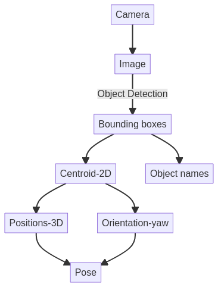

# Cluttered Picking for METRICS HEART-MET competition

## Overall functionality

- The robot perceives its environment and the data is published on the topics to which we subscribe to.
- Once we get the image of the environment, object detection 
is carried out using Faster-RCNN and the object labels along 
with its bounding boxes are detected.
- Then these 2D bounding boxes are used to calculate the centroid of the object which acts as a grasping position in 2D.
- This 2D position is converted to 3D position and the yaw is also calculated, which combinedly gives us the grasing 
pose of the object.
- This process is looped over for the cluttered picking task.

## How to run the code:

To run the code you have to run 2 terminals with the below mentioned commands:

#### Terminal-1
Run object detection code:  
`roslaunch object_detection grasp_pose_estimation.launch`

#### Terminal-2
Publish images from rosbag files continuously:  
`rosbag play -l <path_to_bag_file/_.bag>`
 